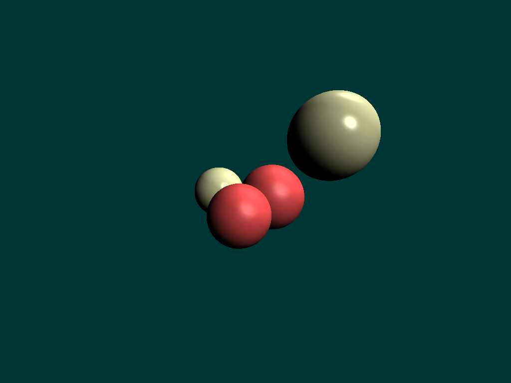
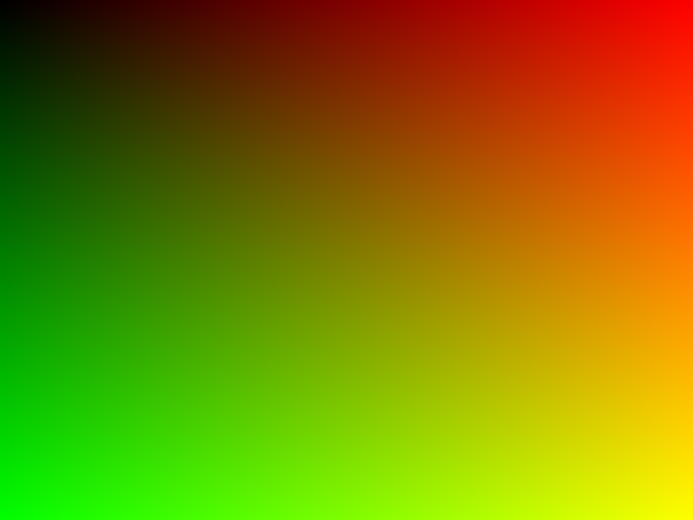
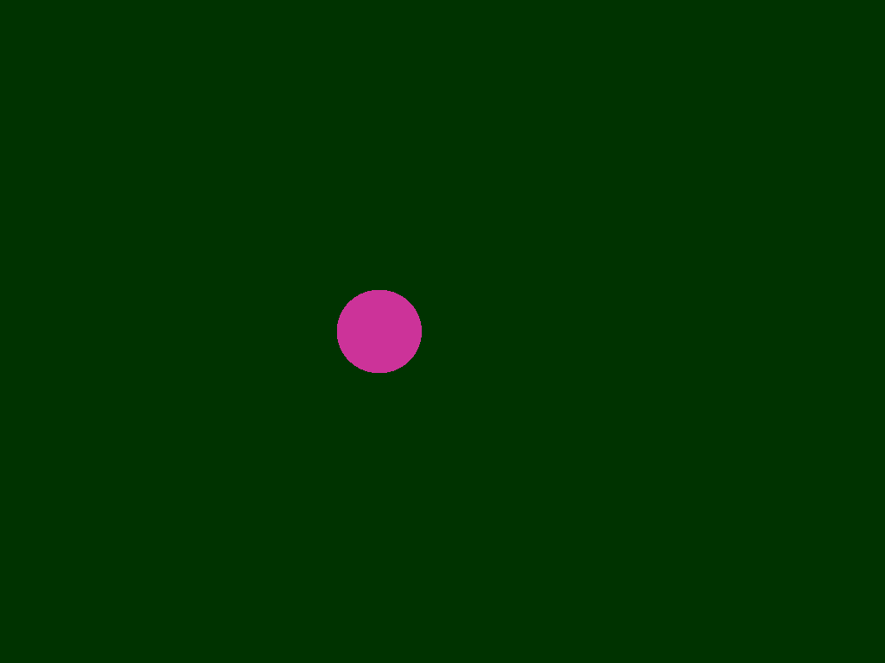
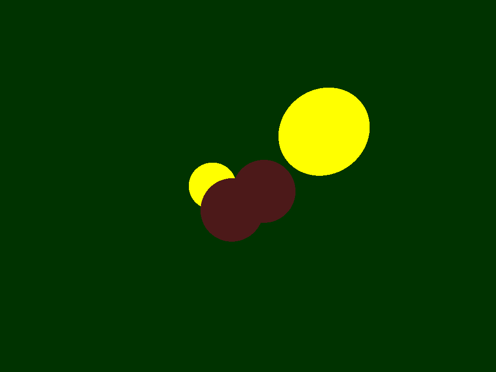
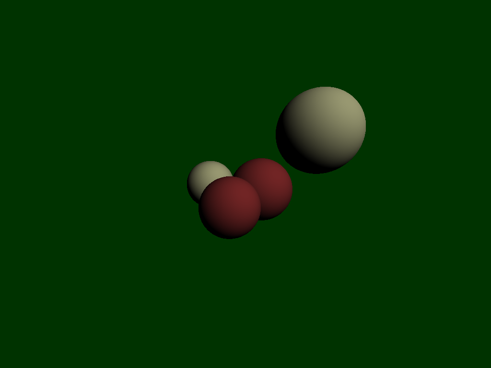
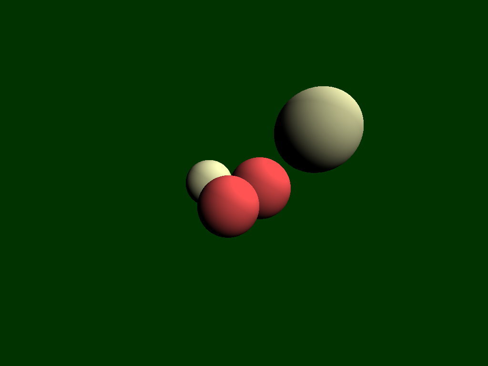

# Tiny Raytacer
This is a implementation of a ray tracer in rust based off of ssloy's.
Each step will contain my code written for that step.

## After rewrite:

I am a little giddy right now because usually these projects never go that 
smoothly. I rewrote all the code or at least edited it and it works better than
I had hoped! I found writing it in a much more readable rustlike was helped. By 
no means is the code clean or slick in any way but it works and I understand it 
which is a great feeling. I also managed to write it to be extensible, anything
that can calculate a normal, check if the ray hit it, and has a material can be 
rendered by this.

### Result:


### Future:

Now that I have this framework set up I will work on adding more renderables,
including planes and meshes and provide a way for the background to be changed
from a single color to a image. Another thing is reflection and refraction are 
incomplete so that needs to be done aswell.

## Step 1:

This step just gets writing a image to work. I found the rust version to be much
more readable than the c++ version.

```rust
extern crate image;

fn render() {
    let width = 1024;
    let height = 768;

    let mut imgbuf = image::ImageBuffer::new(width, height);

    for (x, y, pixel) in imgbuf.enumerate_pixels_mut() {
        let red = ((x as f32 / width as f32) * 255.0) as u8;
        let green = ((y as f32 / height as f32) * 255.0) as u8;
        *pixel = image::Rgb([red, green, 0]);
    }

    imgbuf.save("oneframe.png").expect("Could not write image");
}

fn main() {
    render();
}
```

### Result


## Step 2:

This part was really fun and frusterating for a bit. Once I understood the math
I felt very comfortable with it and it just made sense. What I think is really 
cool is I felt I could implement a rendering engine from this using traits in 
rust.

### Result


## Step 3:

This part was easy, one thing I noticed is that the tutorial checks each object 
to see if there is a collision and then after checks which one should be shown.
I think, however am not sure, that we could just sort the items by distance from
camera and then break as soon as we see the first one. I'm sure this has already
been though of and I might find out later its dumb but I wonder how big of a 
difference, if any it would make.

### Result:


## Step 4:

This was a big step for me and made me realize why a game might not use this.
Still its pretty cool and fun to write. One issue is that if the color is 
already white then adding light to make it more light makes it black. I know 
how I could fix it to not round but I feel like there is a better way.

### Result:


## Step 5:

This step I had issues with, I found that the way the original was programmed 
was very C style, mutating instead of immutable, so I found it much harder to 
understand. I think instead of moving onto the next step I am going to restart
the project and write it in a way that makes sense to me and include 
extensions to render other things than circle and planes.

### Result:
